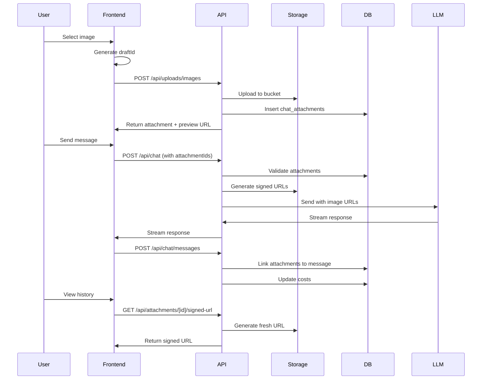
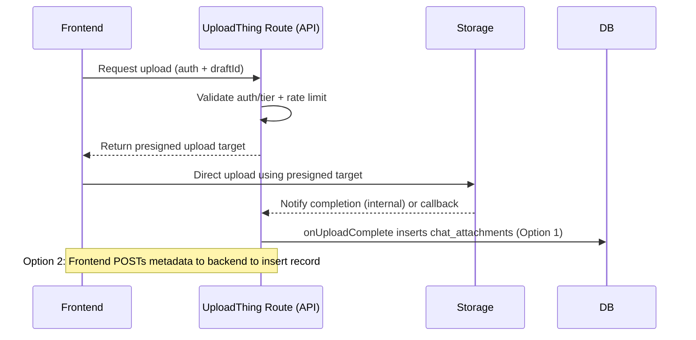

# Image Attachments Architecture - Complete Design

## Overview

The image attachment system enables users to upload images (PNG, JPEG, WebP) to Supabase Storage and attach them to chat messages. The system enforces tier-based limits, manages lifecycle through draft states, and handles secure URL generation for LLM processing.

## Core Components

### 1. Database Schema

#### `chat_attachments` Table

```sql
- id (UUID, primary key)
- user_id (UUID, references auth.users)
- message_id (UUID, nullable, references chat_messages)
- session_id (UUID, nullable, references chat_sessions)
- draft_id (UUID, not null) - Groups attachments before message send
- storage_path (text) - Path in Supabase Storage
- mime_type (text) - image/png, image/jpeg, image/webp
- size_bytes (bigint) - File size
- original_name (text) - User's original filename
- status (text) - 'ready' | 'deleted'
- created_at (timestamp)
- deleted_at (timestamp, nullable)
```

#### Storage Bucket

- Bucket: `attachments-images` (private)
- Path format: `{userId}/yyyy/mm/dd/drafts/{draftId}/{uuid}.{ext}`
- RLS policies enforce user-owned access only

### 2. Upload Flow

#### POST `/api/uploads/images`

**Purpose**: Upload image to storage and create DB record

**Request**:

```typescript
Content-Type: multipart/form-data
- image: File (required, max 5MB free/10MB pro)
- draftId: string (required, UUID)
- sessionId?: string (optional)
- originalName?: string (optional)
```

**Process**:

1. Validate authentication (withProtectedAuth)
2. Check tier-based size limits (5MB free, 10MB pro/enterprise)
3. Validate MIME type (png/jpeg/webp only)
4. Check pending attachment count (max 3 per draft)
5. Generate storage path: `{userId}/yyyy/mm/dd/drafts/{draftId}/{uuid}.{ext}`
6. Upload to Supabase Storage bucket
7. Insert record into `chat_attachments` with status='ready'
8. Generate preview signed URL (5 min TTL)

**Response**:

```json
{
  "id": "attachment-uuid",
  "mime": "image/png",
  "size": 1024000,
  "storagePath": "user-id/2025/01/15/drafts/draft-id/file.png",
  "previewUrl": "https://...",
  "previewUrlTtlSeconds": 300,
  "originalName": "screenshot.png"
}
```

### 3. Draft Management

**Draft ID Purpose**:

- Groups multiple attachments before message is sent
- Prevents orphaned attachments if message is abandoned
- Enables batch operations (delete all draft attachments)
- Tracks pending uploads per conversation attempt

**Frontend Generation**:

```typescript
// ChatInput.tsx
const [draftId] = useState(() => crypto.randomUUID());
```

**Lifecycle**:

1. Generated once per message composition
2. Shared across all attachments for that message
3. Used to enforce 3-attachment limit
4. Cleared after message send or cancel

### 4. Frontend Upload Handling

#### Maximum 3 Images Enforcement

```typescript
// ChatInput.tsx
const canAddMore = attachments.length < 3;
const remainingSlots = 3 - attachments.length;

if (files.length + attachments.length > 3) {
  toast.error(`Maximum 3 images allowed. You can add ${remainingSlots} more.`);
  return;
}
```

#### Error Handling

```typescript
// Upload errors are caught and displayed
try {
  const response = await uploadImage(file, draftId, sessionId);
  if (!response.ok) {
    const error = await response.json();
    toast.error(error.message || "Upload failed");
  }
} catch (error) {
  toast.error("Network error during upload");
}
```

#### Delete Attachment

```typescript
// Frontend deletion
const handleRemoveAttachment = async (attachmentId: string) => {
  try {
    await fetch(`/api/attachments/${attachmentId}`, {
      method: "DELETE",
    });
    setAttachments((prev) => prev.filter((a) => a.id !== attachmentId));
  } catch (error) {
    toast.error("Failed to remove attachment");
  }
};
```

### 5. Message Send Flow

#### Generate Signed URLs for LLM

When sending message with attachments:

```typescript
// POST /api/chat or /api/chat/stream
{
  messages: [...],
  attachmentIds: ["id1", "id2"],
  draftId: "draft-uuid"
}
```

Backend process:

1. Validate attachment ownership
2. Generate fresh signed URLs (5 min TTL)
3. Format for OpenRouter API:

```json
{
  "role": "user",
  "content": [
    { "type": "text", "text": "user message" },
    { "type": "image_url", "image_url": { "url": "signed-url-1" } },
    { "type": "image_url", "image_url": { "url": "signed-url-2" } }
  ]
}
```

### 6. Message Persistence & Linking

#### POST `/api/chat/messages`

After LLM response, persist messages and link attachments:

```typescript
// Request
{
  messages: [...],
  attachmentIds: ["id1", "id2"],
  sessionId: "session-uuid"
}
```

**Process**:

1. Create user message record with `has_attachments=true`
2. Update `chat_attachments` records:
   - Set `message_id` to link to message
   - Set `session_id` for session association
3. Trigger recomputes image costs based on model pricing
4. Clear draft association

### 7. History Loading & Signed URL Regeneration

#### GET `/api/attachments/[id]/signed-url`

When loading conversation history:

```typescript
// Frontend calls for each attachment
const signedUrl = await fetch(`/api/attachments/${id}/signed-url`);
```

**Process**:

1. Verify user ownership
2. Check attachment status='ready'
3. Generate fresh signed URL (5 min TTL)
4. Return URL for display

**Response**:

```json
{
  "id": "attachment-id",
  "signedUrl": "https://...",
  "ttlSeconds": 300
}
```

### 8. Retention & Cleanup

#### Admin Dashboard - Attachment Tab

Located at `/admin/attachments`, provides:

1. **Orphaned Attachments Cleanup**:

   - Finds `chat_attachments` where `message_id IS NULL`
   - Age threshold: 24 hours old
   - Soft deletes DB records (status='deleted')
   - Removes from Supabase Storage

2. **Storage Orphans Cleanup**:

   - Finds files in `storage.objects` not linked to `chat_attachments`
   - Removes dangling storage objects

3. **Retention Policy** (configurable):
   - Default: 30 days for linked attachments
   - 24 hours for unlinked drafts
   - Respects tier-based retention settings

#### Cleanup SQL Queries

```sql
-- Find orphaned attachments
SELECT * FROM chat_attachments
WHERE message_id IS NULL
  AND created_at < NOW() - INTERVAL '24 hours'
  AND status = 'ready';

-- Find storage orphans
SELECT s.* FROM storage.objects s
LEFT JOIN chat_attachments a ON a.storage_path = s.name
WHERE s.bucket_id = 'attachments-images'
  AND a.id IS NULL;
```

## Security & Rate Limiting

### Authentication

- All endpoints use `withProtectedAuth` middleware
- User ownership validated at every step
- Signed URLs expire in 5 minutes

### Rate Limits

- Upload: 30/min/user (×2 for Pro/Enterprise)
- Signed URL: 120/min/user
- Delete: 60/min/user

### Tier-Based Limits

```typescript
const limits = {
  free: { maxSize: 5 * 1024 * 1024, maxCount: 3 },
  pro: { maxSize: 10 * 1024 * 1024, maxCount: 3 },
  enterprise: { maxSize: 10 * 1024 * 1024, maxCount: 3 },
};
```

## Cost Attribution

### Image Pricing

- Stored in `model_access.image_price` per model
- Calculated on message persistence
- Added to total message cost

### Cost Calculation

```sql
-- Trigger updates on message link
UPDATE chat_messages
SET image_units = attachment_count,
    image_cost = attachment_count * model.image_price,
    total_cost = prompt_cost + completion_cost + image_cost
WHERE id = NEW.message_id;
```

## Error Handling

### HTTP Status Codes

- 400: Invalid input (MIME, size, count)
- 401: Unauthenticated
- 403/404: Ownership violation (404 preferred)
- 409: Conflict (already linked)
- 413: File too large
- 429: Rate limited
- 500: Storage/internal error

### Frontend Error Display

```typescript
// Consistent toast notifications
toast.error("File too large. Maximum 5MB for free tier.");
toast.error("Only PNG, JPEG, and WebP images allowed.");
toast.error("Maximum 3 images per message.");
```

## Data Flow Summary



## UploadThing Migration Notes (New Flow)

This section documents the migration from the legacy upload endpoint to an UploadThing-powered direct-to-storage approach.

### Legacy Flow (Current in this doc)

- Endpoint: `POST /api/uploads/images`
- Behavior: Our backend receives multipart form-data, uploads bytes to Supabase Storage, then inserts into `chat_attachments`, and returns the created attachment record and preview URL.
- Characteristics: Simple, but all file bytes pass through our servers (ingress/egress) and can be a bottleneck under load.

### New Flow (UploadThing + Direct-to-S3)

- Initiation: Client calls our UploadThing server route (file router) on our backend.
- Auth and Limits: On that request, we enforce authentication and subscription tier checks via standardized middleware and apply rate limiting.
- Presigned Upload: Our backend responds with a short‑lived signed upload target (conceptually a presigned URL/POST) for the client.
- Direct Upload: The client uploads the file bytes directly to storage (UploadThing’s storage or our S3), bypassing our servers for the data stream.
- Completion: After successful upload, we persist metadata to `chat_attachments` using one of two patterns:
  1. Server-side hook: Use UploadThing’s `onUploadComplete` on the server to insert the DB record immediately. This is preferred when we can pass needed context (e.g., `userId`, `draftId`, `sessionId`) during the initial request. No extra client call required.
  2. Client callback: After upload succeeds, the frontend calls our backend endpoint (e.g., `POST /api/attachments/register`) with file metadata (key/url/mime/size, `draftId`, etc.) to insert into `chat_attachments`. Use this when association isn’t known until after upload.

### Private Buckets and Access

- With UploadThing Pro + BYO S3, uploads land in our private S3 bucket using short‑lived credentials. We do not expose long‑lived credentials client-side.
- For reading private files, generate time‑limited access on the server:
  - If using UploadThing-hosted private storage: call their server-side signed URL helper or proxy through our API.
  - If using our own S3 private bucket: generate presigned GET URLs from our backend (same as current signed URL endpoints).

### Required Middleware and Limits

- Always use standardized auth wrappers per our project conventions (see `lib/middleware/auth`). Examples:
  - Protected: `withProtectedAuth`
  - Enhanced: `withEnhancedAuth`
  - Tier-specific: `withTierAuth`
  - Conversation-protected: `withConversationOwnership`
- Apply tiered rate limiting with `withTieredRateLimit` (Tier B for storage/DB endpoints). Do not implement manual auth/limits in handlers.

### Idempotency and Quotas

- Make `onUploadComplete` idempotent (e.g., unique constraint on `(storage_path|file_key, draft_id)` or a safe UPSERT) to prevent duplicate rows on retries.
- Enforce per-draft limits (max 3 images) and tier file-size caps during the presign/initiation step.

### Sequence (New Flow)



### Migration Impact

- The legacy `/api/uploads/images` endpoint can be deprecated after all clients move to the UploadThing flow.
- Message send, signed URL regeneration, and cleanup flows remain the same; only the upload initiation and persistence mechanism changes.

## Key Design Decisions

1. **Private Storage**: All images in private bucket with signed URL access
2. **Draft Pattern**: Prevents orphans, enables batch operations
3. **Short TTL URLs**: 5-minute expiry balances security and usability
4. **Soft Deletes**: Maintains audit trail while cleaning storage
5. **Tier-Based Limits**: Free (5MB), Pro/Enterprise (10MB)
6. **Cost Attribution**: Per-image pricing tracked at message level
7. **Ownership Model**: Strict user-based access control throughout

## Future Enhancements

1. **Thumbnails**: Generate and cache smaller previews
2. **CDN Integration**: Improve global distribution
3. **EXIF Stripping**: Remove metadata for privacy
4. **PDF Support**: Extend beyond images
5. **Compression**: Server-side optimization before storage
6. **Batch Upload**: Multiple files in single request
7. **Progress Tracking**: WebSocket-based upload progress
