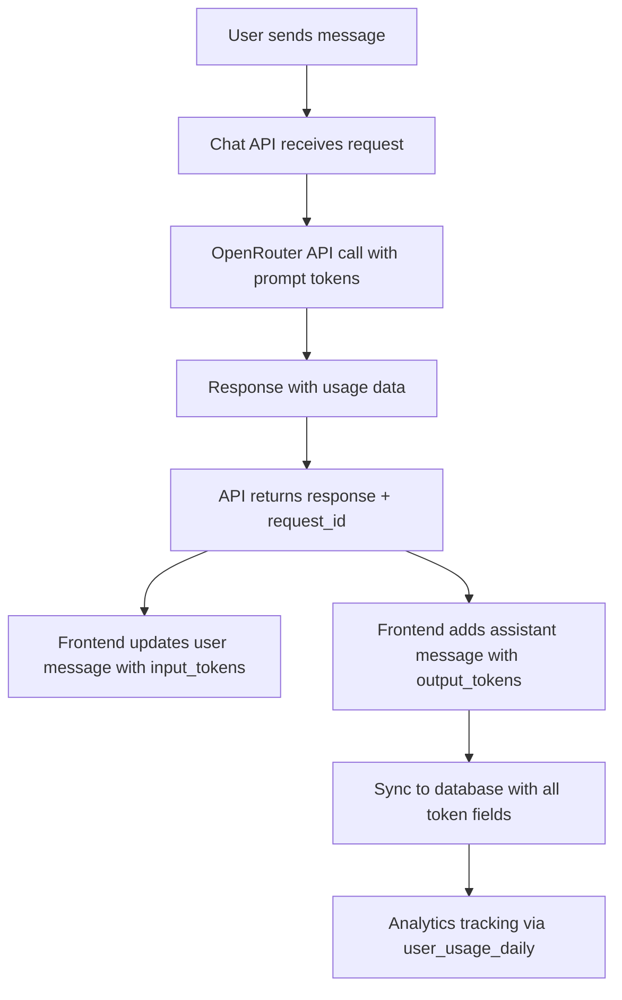

# Token Enhancement Implementation Summary

## Overview

This document summarizes the comprehensive implementation of the sync input/output token feature, which enhances the OpenRouter Chatbot to track and display separate input and output tokens for both user and assistant messages.

## Implementation Status: ✅ CORE FEATURES COMPLETE

### ✅ Completed Components

#### 1. Database Schema Enhancement

- **File**: [`database/05-token-enhancement-migration.sql`](../database/05-token-enhancement-migration.sql)
- **Changes**:
  - Added `input_tokens` column to `chat_messages` table
  - Added `output_tokens` column to `chat_messages` table
  - Added `user_message_id` column to link assistant responses to user messages
  - Created performance indexes for token queries
  - Enhanced sync functions with token support
  - Automatic data migration for existing records

#### 2. API Response Enhancement

- **File**: [`src/app/api/chat/route.ts`](../src/app/api/chat/route.ts)
- **Changes**:
  - Added `request_id` field to link assistant responses to user messages
  - Enhanced response structure to include separate token tracking
  - Maintains backward compatibility with existing `total_tokens`

#### 3. Type System Updates

- **File**: [`lib/types/chat.ts`](../lib/types/chat.ts)
- **Changes**:
  - Added `input_tokens`, `output_tokens`, `user_message_id` to `ChatMessage` interface
  - Added `request_id` to `ChatResponse` interface
  - Full TypeScript support for new token structure

#### 4. Frontend Hook Enhancement

- **File**: [`hooks/useChat.ts`](../hooks/useChat.ts)
- **Changes**:
  - Enhanced assistant message creation with separate token tracking
  - Real-time user message updates when assistant response arrives
  - Proper token linking between user and assistant messages

#### 5. UI Component Updates

- **File**: [`components/chat/MessageList.tsx`](../components/chat/MessageList.tsx)
- **Changes**:
  - User messages now display input token count
  - Assistant messages show detailed token breakdown (Input/Output/Total)
  - Enhanced token display formatting

#### 6. Sync API Enhancement

- **File**: [`src/app/api/chat/sync/route.ts`](../src/app/api/chat/sync/route.ts)
- **Changes**:
  - POST endpoint handles new token fields when syncing to database
  - GET endpoint returns enhanced token data from database
  - Full two-way synchronization support

## Key Features Implemented

### 🔗 Message Linking

- Assistant responses are linked to the user message that triggered them via `user_message_id`
- API responses include `request_id` to identify the originating user message
- Real-time token updates when assistant responses arrive

### 📊 Enhanced Token Display

- **User Messages**: Show input token count when available
- **Assistant Messages**: Display detailed breakdown:
  - Input tokens (prompt tokens)
  - Output tokens (completion tokens)
  - Total tokens
  - Response time and model information

### 🔄 Comprehensive Sync Support

- Database migration handles existing data gracefully
- Enhanced sync functions support new token fields
- Backward compatibility maintained throughout

### 🏗️ Integration with Existing Analytics

- Leverages existing [`user_usage_daily`](../database/03-complete-user-enhancements.sql) infrastructure
- Compatible with [`track_user_usage()`](../database/03-complete-user-enhancements.sql) function
- Maintains data consistency across all tracking systems

## Data Flow Architecture



## Database Schema Changes

### New Columns in `chat_messages` Table

```sql
-- Input tokens (for user messages)
input_tokens INTEGER DEFAULT 0

-- Output tokens (for assistant messages)
output_tokens INTEGER DEFAULT 0

-- Links assistant messages to user messages
user_message_id TEXT
```

### Performance Indexes

```sql
-- User message linking
CREATE INDEX idx_chat_messages_user_message_id
ON chat_messages(user_message_id);

-- Token analytics
CREATE INDEX idx_chat_messages_tokens_role
ON chat_messages(role, input_tokens, output_tokens);
```

## API Response Format

### Enhanced Chat Response

```json
{
  "response": "Assistant response content",
  "usage": {
    "prompt_tokens": 32,
    "completion_tokens": 120,
    "total_tokens": 152
  },
  "request_id": "msg_1753195195759_ei5l6ns9o",
  "timestamp": "2025-07-22T14:40:08.777Z",
  "elapsed_time": 11,
  "contentType": "markdown",
  "id": "gen-1753195196-gXqznKSCpyxp9cwouA8v"
}
```

## Frontend Token Display

### User Messages

- Display format: `(32 input tokens)`
- Shows when `input_tokens > 0`
- Updates in real-time when assistant responds

### Assistant Messages

- Display format: `(Took 11s | Input: 32, Output: 120, Total: 152 tokens - gen-1753195196)`
- Comprehensive breakdown of all token types
- Clickable completion ID for pricing details

## Remaining Tasks

### 🔄 Chat Store Integration

- Update Zustand stores to handle new token structure
- Ensure state management consistency

### 📈 Analytics Integration

- Integrate with existing `user_usage_daily` tracking
- Ensure token data flows to analytics dashboard

### 🧪 Testing & Validation

- End-to-end testing of token display and sync
- Database migration testing
- Performance validation

## Migration Instructions

### 1. Database Migration

```sql
-- Execute the migration script
\i database/05-token-enhancement-migration.sql
```

### 2. Deployment Sequence

1. Deploy database migration first
2. Deploy backend API changes
3. Deploy frontend changes
4. Verify token display functionality

### 3. Verification Steps

1. Send a test message and verify token display
2. Check database for proper token storage
3. Test sync functionality for signed-in users
4. Validate analytics integration

## Benefits Achieved

### 🎯 User Experience

- **Transparency**: Users can see exact input/output token costs
- **Real-time Updates**: Token information appears immediately
- **Detailed Breakdown**: Clear understanding of token usage

### 🔧 Technical Benefits

- **Comprehensive Tracking**: Full token analytics pipeline
- **Backward Compatibility**: Existing functionality preserved
- **Scalable Design**: Ready for future enhancements
- **Performance Optimized**: Efficient database queries and indexes

### 📊 Analytics Benefits

- **Detailed Usage Metrics**: Separate input/output tracking
- **Cost Analysis**: Precise token cost calculations
- **User Behavior Insights**: Understanding of usage patterns

## Future Enhancements

### 💰 Cost Tracking

- Real-time cost calculations based on model pricing
- User spending analytics and budgets
- Cost optimization recommendations

### 📈 Advanced Analytics

- Token usage trends and patterns
- Model efficiency comparisons
- User engagement metrics

### 🎛️ User Controls

- Token usage limits and alerts
- Model selection based on cost preferences
- Usage history and reporting

---

**Implementation Status**: ✅ Core features complete, ready for testing and deployment
**Next Steps**: Complete remaining tasks and perform comprehensive testing
