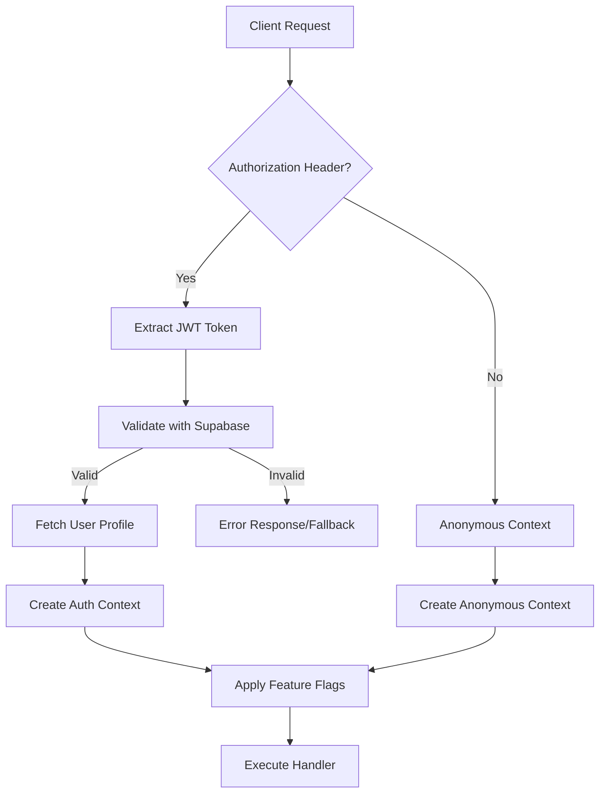

# Phase 1: JWT Authentication Architecture Implementation

## Overview

This document describes the implementation of Phase 1 of the JWT authentication and API security system for the OpenRouter Chatbot project. Phase 1 establishes the core infrastructure for multi-tier access control, JWT validation, and feature flagging.

## Implementation Summary

### ✅ **Completed Components**

#### 1. **Enhanced Type Definitions** ([`lib/types/auth.ts`](../../lib/types/auth.ts))

- **[`AuthContext`](../../lib/types/auth.ts:27)** - Comprehensive authentication context interface
- **[`FeatureFlags`](../../lib/types/auth.ts:17)** - Tier-based feature access control
- **[`UserProfile`](../../lib/types/auth.ts:8)** - Extended user profile with subscription tiers
- **[`AuthErrorCode`](../../lib/types/auth.ts:47)** - JWT-specific error codes
- **[`JWTValidationResult`](../../lib/types/auth.ts:37)** - Token validation response interface

#### 2. **Authentication Utilities** ([`lib/utils/auth.ts`](../../lib/utils/auth.ts))

- **[`validateJWT()`](../../lib/utils/auth.ts:18)** - JWT token validation using Supabase
- **[`extractAuthContext()`](../../lib/utils/auth.ts:75)** - Request authentication context extraction
- **[`fetchUserProfile()`](../../lib/utils/auth.ts:103)** - User profile fetching with caching
- **[`createFeatureFlags()`](../../lib/utils/auth.ts:186)** - Tier-based feature flag generation
- **[`hasPermission()`](../../lib/utils/auth.ts:284)** - Permission validation utilities

#### 3. **Enhanced Error Handling** ([`lib/utils/errors.ts`](../../lib/utils/errors.ts))

- **Extended [`ErrorCode`](../../lib/utils/errors.ts:5)** enum with JWT-specific codes
- **[`createAuthError()`](../../lib/utils/errors.ts:93)** - Authentication error factory
- **[`handleAuthError()`](../../lib/utils/errors.ts:175)** - Specialized auth error handler
- **[`authErrorToErrorCode()`](../../lib/utils/errors.ts:139)** - Error code mapping utilities

#### 4. **Validation Utilities** ([`lib/utils/validation.ts`](../../lib/utils/validation.ts))

- **[`validateModelAccess()`](../../lib/utils/validation.ts:9)** - Model access validation with fallbacks
- **[`validateRequestLimits()`](../../lib/utils/validation.ts:56)** - Token and rate limit validation
- **[`validateChatRequestWithAuth()`](../../lib/utils/validation.ts:149)** - Comprehensive request validation
- **Feature-specific validators** for system prompts, temperature, sync, etc.

#### 5. **Authentication Middleware** ([`lib/middleware/auth.ts`](../../lib/middleware/auth.ts))

- **[`withAuth()`](../../lib/middleware/auth.ts:18)** - Core authentication middleware
- **[`withProtectedAuth()`](../../lib/middleware/auth.ts:85)** - Protected endpoint wrapper
- **[`withEnhancedAuth()`](../../lib/middleware/auth.ts:94)** - Enhanced endpoint wrapper
- **[`withTierAuth()`](../../lib/middleware/auth.ts:103)** - Tier-specific endpoint wrapper
- **[`withConversationOwnership()`](../../lib/middleware/auth.ts:135)** - Conversation ownership validation

## Architecture Overview

### Multi-Tier Access Control



### Access Levels

| Level         | Description                        | Use Cases                                                |
| ------------- | ---------------------------------- | -------------------------------------------------------- |
| **PROTECTED** | Requires valid JWT                 | [`/api/chat/sync`](../../src/app/api/chat/sync/route.ts) |
| **ENHANCED**  | Optional JWT with feature flagging | [`/api/chat`](../../src/app/api/chat/route.ts)           |
| **PUBLIC**    | No authentication required         | `/api/health`                                            |

### Feature Flag System

#### Tier-Based Access Control

| Feature               | Anonymous | Free | Pro  | Enterprise |
| --------------------- | --------- | ---- | ---- | ---------- |
| Custom System Prompt  | ❌        | ✅   | ✅   | ✅         |
| Advanced Models       | ❌        | ❌   | ✅   | ✅         |
| Custom Temperature    | ❌        | ✅   | ✅   | ✅         |
| Conversation Sync     | ❌        | ✅   | ✅   | ✅         |
| Rate Limit (req/hour) | 10        | 100  | 500  | 2000       |
| Max Tokens/Request    | 1000      | 2000 | 4000 | 8000       |
| Analytics Dashboard   | ❌        | ❌   | ✅   | ✅         |

#### Model Access Control

```typescript
// Anonymous Users
allowedModels: [
  "deepseek/deepseek-r1-0528:free",
  "google/gemini-2.5-flash-lite",
];

// Free Tier
allowedModels: [...anonymousModels, "meta-llama/llama-3.2-3b-instruct:free"];

// Pro Tier
allowedModels: [
  ...freeModels,
  "anthropic/claude-3-haiku",
  "openai/gpt-4o-mini",
  "google/gemini-pro",
];

// Enterprise Tier
allowedModels: ["*"]; // All models
```

## Usage Examples

### 1. Protected Endpoint (Requires Authentication)

```typescript
// src/app/api/chat/sync/route.ts
import { withProtectedAuth } from "../../../../lib/middleware/auth";

async function syncHandler(request: NextRequest, authContext: AuthContext) {
  // User is guaranteed to be authenticated with profile
  const { user, profile } = authContext;

  // Implementation...
}

export const POST = withProtectedAuth(syncHandler);
```

### 2. Enhanced Endpoint (Optional Authentication)

```typescript
// src/app/api/chat/route.ts
import { withEnhancedAuth } from "../../../../lib/middleware/auth";
import { validateChatRequestWithAuth } from "../../../../lib/utils/validation";

async function chatHandler(request: NextRequest, authContext: AuthContext) {
  const body = await request.json();

  // Validate request with auth context
  const validation = validateChatRequestWithAuth(body, authContext);

  if (!validation.valid) {
    return NextResponse.json({ errors: validation.errors }, { status: 400 });
  }

  // Use enhanced data with applied feature flags
  const enhancedData = validation.enhancedData;

  // Implementation...
}

export const POST = withEnhancedAuth(chatHandler);
```

### 3. Tier-Specific Endpoint

```typescript
// src/app/api/analytics/route.ts
import { withTierAuth } from "../../../../lib/middleware/auth";

async function analyticsHandler(
  request: NextRequest,
  authContext: AuthContext
) {
  // Only pro and enterprise users can access
  // Implementation...
}

export const GET = withTierAuth(analyticsHandler, "pro");
```

### 4. Conversation Ownership Validation

```typescript
// src/app/api/chat/sync/route.ts
import { withConversationOwnership } from "../../../../lib/middleware/auth";

async function syncHandler(request: NextRequest, authContext: AuthContext) {
  // Conversations ownership is automatically validated
  // Implementation...
}

export const POST = withConversationOwnership(syncHandler);
```

## Error Handling

### Error Response Format

```json
{
  "error": "Authentication token has expired",
  "code": "TOKEN_EXPIRED",
  "retryable": true,
  "suggestions": ["Please refresh your session or sign in again"],
  "timestamp": "2025-01-26T07:30:00.000Z"
}
```

### Error Types

| Error Code              | HTTP Status | Description             | Retryable |
| ----------------------- | ----------- | ----------------------- | --------- |
| `TOKEN_MISSING`         | 401         | No auth token provided  | No        |
| `TOKEN_EXPIRED`         | 401         | Token has expired       | Yes       |
| `TOKEN_INVALID`         | 401         | Invalid token format    | No        |
| `AUTH_REQUIRED`         | 401         | Authentication required | No        |
| `TIER_UPGRADE_REQUIRED` | 402         | Higher tier needed      | No        |
| `RATE_LIMIT_EXCEEDED`   | 429         | Rate limit hit          | Yes       |

## Integration with Existing Code

### Supabase Integration

The authentication system seamlessly integrates with the existing Supabase setup:

- **Client-side**: Uses existing [`useAuthStore`](../../stores/useAuthStore.ts) for UI state
- **Server-side**: Leverages [`lib/supabase/server.ts`](../../lib/supabase/server.ts) for JWT validation
- **Database**: Extends existing user management with profile tables

### Backward Compatibility

- **Existing endpoints** continue to work without modification
- **Gradual migration** approach allows incremental adoption
- **Feature flags** provide graceful degradation for unauthenticated users

## Security Features

### Token Security

- **Server-side validation** on every request
- **Automatic token refresh** handled by Supabase
- **Secure transmission** via Authorization headers
- **Error masking** prevents information leakage

### Data Protection

- **User isolation** through conversation ownership validation
- **Input validation** and sanitization
- **Audit logging** for authentication events
- **Rate limiting** to prevent abuse

## Performance Considerations

### Caching Strategy

- **User profiles** cached after first fetch
- **Feature flags** computed once per request
- **JWT validation** leverages Supabase's optimized validation

### Optimization

- **Lazy loading** of user profiles
- **Efficient error handling** with early returns
- **Minimal database queries** through smart caching

## Next Steps (Phase 2)

1. **Rate Limiting Implementation**

   - Redis-based rate limiting
   - Abuse detection patterns
   - Dynamic rate limit adjustment

2. **Enhanced Security**

   - Request signing
   - IP-based restrictions
   - Advanced threat detection

3. **Monitoring & Analytics**
   - Authentication metrics
   - Performance monitoring
   - Security event tracking

## Testing

### Unit Tests Required

```typescript
// tests/auth/validateJWT.test.ts
describe("validateJWT", () => {
  it("should validate valid JWT tokens");
  it("should reject expired tokens");
  it("should handle malformed tokens");
});

// tests/middleware/auth.test.ts
describe("withAuth middleware", () => {
  it("should require authentication when configured");
  it("should allow anonymous access when configured");
  it("should validate tier requirements");
});
```

### Integration Tests Required

```typescript
// tests/api/protected-endpoints.test.ts
describe("Protected API endpoints", () => {
  it("should reject unauthenticated requests");
  it("should accept valid authenticated requests");
  it("should validate conversation ownership");
});
```

## Conclusion

Phase 1 successfully establishes the core authentication infrastructure with:

- ✅ **Comprehensive type safety** with TypeScript interfaces
- ✅ **Flexible middleware system** for different authentication requirements
- ✅ **Tier-based feature flagging** for subscription management
- ✅ **Robust error handling** with detailed error codes
- ✅ **Security-first design** with validation and ownership checks
- ✅ **Backward compatibility** with existing codebase

The implementation provides a solid foundation for Phase 2 (rate limiting) and Phase 3 (endpoint security) while maintaining the flexibility to serve both authenticated and anonymous users effectively.
