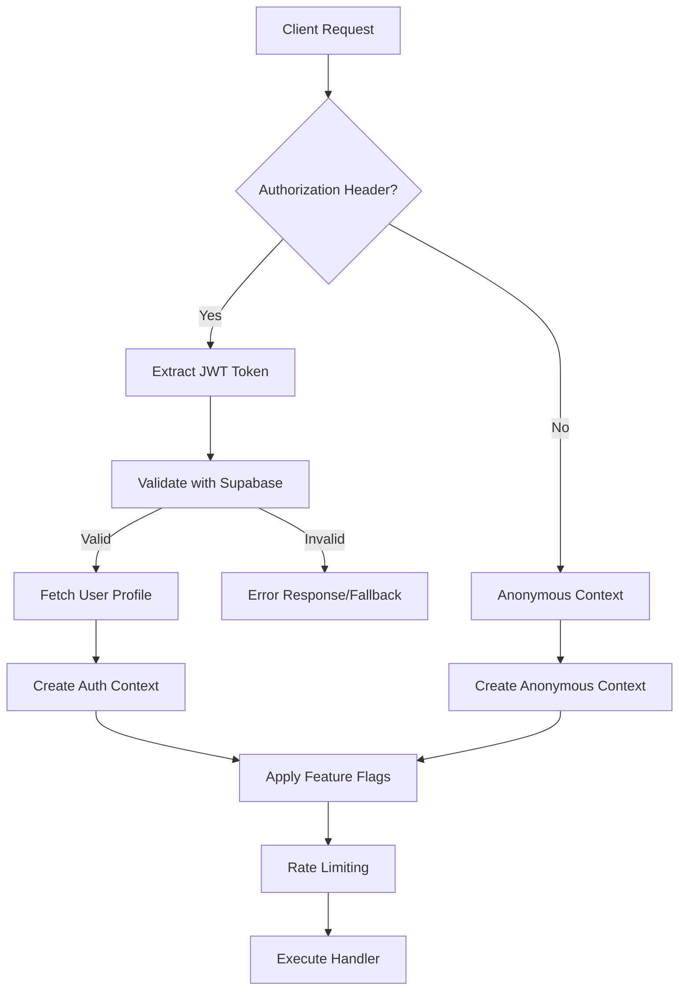

# JWT Authentication and API Security Implementation Plan

## Overview

This document provides a comprehensive implementation plan for JWT authentication and securing API endpoints in the OpenRouter Chatbot project. The implementation focuses on multi-tier access control, protecting the `/api/chat/sync` endpoint, and enabling graceful degradation for mixed authentication scenarios.

## Table of Contents

1. [Current State Analysis](#current-state-analysis)
2. [Architecture Overview](#architecture-overview)
3. [Implementation Components](#implementation-components)
4. [API Endpoint Security](#api-endpoint-security)
5. [Feature Flagging System](#feature-flagging-system)
6. [Error Handling](#error-handling)
7. [Rate Limiting](#rate-limiting)
8. [Testing Strategy](#testing-strategy)
9. [Migration Plan](#migration-plan)
10. [Dependencies](#dependencies)

## Current State Analysis

### Existing Authentication Patterns

- **Supabase Auth**: Google OAuth with JWT tokens
- **Inconsistent Protection**: Some endpoints protected, others not
- **Security Gaps**: `/api/chat` endpoint vulnerable to abuse
- **No Middleware**: Each endpoint implements its own auth check

### Security Vulnerabilities Identified

1. **API Key Abuse**: Unauthenticated users can consume OpenRouter API credits
2. **No Rate Limiting**: Vulnerable to automated abuse
3. **Inconsistent Auth**: Different patterns across endpoints
4. **Missing Feature Control**: No tier-based access control

## Architecture Overview

### Multi-Tier Access Control



### Access Levels

1. **PROTECTED** - Requires valid JWT (e.g., `/api/chat/sync`)
2. **ENHANCED** - Optional JWT with feature flagging (e.g., `/api/chat`)
3. **PUBLIC** - No authentication required (e.g., `/api/health`)

## Implementation Components

### 1. Core Types and Interfaces

```typescript
// lib/types/auth.ts
export interface AuthContext {
  isAuthenticated: boolean;
  user: User | null;
  profile: UserProfile | null;
  accessLevel: "anonymous" | "authenticated";
  features: FeatureFlags;
}

export interface UserProfile {
  id: string;
  email: string;
  full_name?: string;
  avatar_url?: string;
  default_model: string;
  temperature: number;
  system_prompt: string;
  subscription_tier: "free" | "pro" | "enterprise";
  credits: number;
}

export interface FeatureFlags {
  // Chat capabilities
  canModifySystemPrompt: boolean;
  canAccessAdvancedModels: boolean;
  canUseCustomTemperature: boolean;
  canSaveConversations: boolean;
  canSyncConversations: boolean;

  // Rate limiting
  maxRequestsPerHour: number;
  maxTokensPerRequest: number;
  hasRateLimitBypass: boolean;

  // Model access
  allowedModels: string[];
  canUseProModels: boolean;
  canUseEnterpriseModels: boolean;

  // UI features
  showAdvancedSettings: boolean;
  canExportConversations: boolean;
  hasAnalyticsDashboard: boolean;
}
```

### 2. Authentication Utilities

```typescript
// lib/utils/auth.ts
export async function validateJWT(token: string): Promise<{
  valid: boolean;
  user: User | null;
  error?: AuthError;
}>;

export async function extractAuthContext(
  request: NextRequest
): Promise<AuthContext>;

export async function fetchUserProfile(
  userId: string
): Promise<UserProfile | null>;

export function createAnonymousContext(): AuthContext;

export function createAuthenticatedContext(
  user: User,
  profile: UserProfile | null
): AuthContext;
```

### 3. Feature Flagging System

```typescript
// lib/utils/features.ts
export function createFeatureFlags(
  isAuthenticated: boolean,
  profile?: UserProfile
): FeatureFlags {
  if (!isAuthenticated) {
    return {
      canModifySystemPrompt: false,
      canAccessAdvancedModels: false,
      canUseCustomTemperature: false,
      canSaveConversations: false,
      canSyncConversations: false,
      maxRequestsPerHour: 10,
      maxTokensPerRequest: 1000,
      hasRateLimitBypass: false,
      allowedModels: [
        "deepseek/deepseek-r1-0528:free",
        "google/gemini-2.5-flash-lite",
      ],
      canUseProModels: false,
      canUseEnterpriseModels: false,
      showAdvancedSettings: false,
      canExportConversations: false,
      hasAnalyticsDashboard: false,
    };
  }

  const tier = profile?.subscription_tier || "free";
  // Tier-specific feature flags implementation...
}
```

### 4. Authentication Middleware

```typescript
// lib/middleware/auth.ts
export function withAuth<T extends NextRequest>(
  handler: (req: T, context: AuthContext) => Promise<NextResponse>,
  options: {
    required: boolean;
    allowAnonymous?: boolean;
  } = { required: true }
) {
  return async (req: T): Promise<NextResponse> => {
    // Implementation with comprehensive error handling
  };
}
```

## API Endpoint Security

### Protected Endpoint Pattern (`/api/chat/sync`)

```typescript
// src/app/api/chat/sync/route.ts
import { withAuth } from "../../../../../lib/middleware/auth";
import { withRateLimit } from "../../../../../lib/middleware/rateLimitMiddleware";

async function syncHandler(request: NextRequest, authContext: AuthContext) {
  // User is guaranteed to be authenticated
  const { user, profile } = authContext;

  // Validate conversation ownership
  const { conversations } = await request.json();
  const invalidConversations = conversations.filter(
    (conv) => conv.userId !== user!.id
  );

  if (invalidConversations.length > 0) {
    return NextResponse.json(
      {
        error: "Unauthorized conversation access",
        code: "INVALID_OWNERSHIP",
      },
      { status: 403 }
    );
  }

  // Proceed with sync logic...
}

export const POST = withRateLimit(withAuth(syncHandler, { required: true }));
```

### Enhanced Endpoint Pattern (`/api/chat`)

```typescript
// src/app/api/chat/route.ts
async function chatHandler(request: NextRequest, authContext: AuthContext) {
  const body = await request.json();
  const { data, error } = validateChatRequest(body);

  if (error) {
    return NextResponse.json({ error }, { status: 400 });
  }

  // Apply user settings and feature flags
  const enhancedData = await applyUserSettings(data!, authContext);

  // Validate model access
  const modelValidation = validateModelAccess(
    enhancedData.model,
    authContext.features
  );
  if (!modelValidation.allowed) {
    enhancedData.model = modelValidation.fallbackModel!;
  }

  // Validate token limits
  const tokenValidation = validateRequestLimits(
    estimateTokenCount(enhancedData.messages),
    authContext.features
  );

  if (!tokenValidation.allowed) {
    return NextResponse.json(
      {
        error: "Request too large",
        code: "TOKEN_LIMIT_EXCEEDED",
        maxTokens: authContext.features.maxTokensPerRequest,
      },
      { status: 413 }
    );
  }

  // Execute OpenRouter request with user context
}

export const POST = withRateLimit(
  withAuth(chatHandler, {
    required: false,
    allowAnonymous: true,
  })
);
```

## Feature Flagging System

### Tier-Based Access Control

| Feature               | Anonymous | Free | Pro  | Enterprise |
| --------------------- | --------- | ---- | ---- | ---------- |
| Custom System Prompt  | ❌        | ✅   | ✅   | ✅         |
| Advanced Models       | ❌        | ❌   | ✅   | ✅         |
| Custom Temperature    | ❌        | ✅   | ✅   | ✅         |
| Conversation Sync     | ❌        | ✅   | ✅   | ✅         |
| Rate Limit (req/hour) | 10        | 100  | 500  | 2000       |
| Max Tokens/Request    | 1000      | 2000 | 4000 | 8000       |
| Analytics Dashboard   | ❌        | ❌   | ✅   | ✅         |

### Model Access Control

```typescript
// Anonymous Users
allowedModels: [
  "deepseek/deepseek-r1-0528:free",
  "google/gemini-2.5-flash-lite",
];

// Free Tier
allowedModels: [...anonymousModels, "meta-llama/llama-3.2-3b-instruct:free"];

// Pro Tier
allowedModels: [
  ...freeModels,
  "anthropic/claude-3-haiku",
  "openai/gpt-4o-mini",
  "google/gemini-pro",
];

// Enterprise Tier
allowedModels: ["*"]; // All models
```

## Error Handling

### Error Types and Codes

```typescript
export enum AuthErrorCode {
  // Token errors
  TOKEN_MISSING = "TOKEN_MISSING",
  TOKEN_INVALID = "TOKEN_INVALID",
  TOKEN_EXPIRED = "TOKEN_EXPIRED",
  TOKEN_MALFORMED = "TOKEN_MALFORMED",

  // Authentication errors
  AUTH_REQUIRED = "AUTH_REQUIRED",
  AUTH_FAILED = "AUTH_FAILED",
  USER_NOT_FOUND = "USER_NOT_FOUND",

  // Authorization errors
  INSUFFICIENT_PERMISSIONS = "INSUFFICIENT_PERMISSIONS",
  TIER_UPGRADE_REQUIRED = "TIER_UPGRADE_REQUIRED",
  FEATURE_NOT_AVAILABLE = "FEATURE_NOT_AVAILABLE",

  // Rate limiting
  RATE_LIMIT_EXCEEDED = "RATE_LIMIT_EXCEEDED",
  TOKEN_LIMIT_EXCEEDED = "TOKEN_LIMIT_EXCEEDED",

  // Server errors
  AUTH_SERVICE_UNAVAILABLE = "AUTH_SERVICE_UNAVAILABLE",
  PROFILE_FETCH_FAILED = "PROFILE_FETCH_FAILED",
}
```

### Error Response Format

```json
{
  "error": "Authentication token has expired",
  "code": "TOKEN_EXPIRED",
  "retryable": true,
  "suggestedAction": "Please refresh your session or sign in again",
  "timestamp": "2025-01-26T07:30:00.000Z"
}
```

## Rate Limiting

### Multi-Layer Rate Limiting

1. **Global Rate Limit**: 1000 requests/minute across all users
2. **Tier-Based Limits**: Different limits per subscription tier
3. **IP-Based Limits**: For anonymous users
4. **User-Based Limits**: For authenticated users

### Rate Limit Headers

```
X-RateLimit-Remaining: 95
X-RateLimit-Reset: 2025-01-26T08:30:00.000Z
Retry-After: 3600
```

### Abuse Detection

- **Pattern Analysis**: Detect automated requests
- **Error Rate Monitoring**: High error rates indicate abuse
- **Token Usage Tracking**: Excessive token consumption
- **IP Reputation**: Block known malicious IPs

## Testing Strategy

### Unit Tests

```typescript
// tests/auth/validateJWT.test.ts
describe("validateJWT", () => {
  it("should validate valid JWT tokens", async () => {
    const result = await validateJWT(validToken);
    expect(result.valid).toBe(true);
    expect(result.user).toBeDefined();
  });

  it("should reject expired tokens", async () => {
    const result = await validateJWT(expiredToken);
    expect(result.valid).toBe(false);
    expect(result.error?.code).toBe(AuthErrorCode.TOKEN_EXPIRED);
  });
});
```

### Integration Tests

```typescript
// tests/api/chat-sync.test.ts
describe("/api/chat/sync", () => {
  it("should require authentication", async () => {
    const response = await fetch("/api/chat/sync", {
      method: "POST",
      body: JSON.stringify({ conversations: [] }),
    });

    expect(response.status).toBe(401);
    expect(await response.json()).toMatchObject({
      code: "AUTH_REQUIRED",
    });
  });

  it("should sync conversations for authenticated users", async () => {
    const response = await fetch("/api/chat/sync", {
      method: "POST",
      headers: {
        Authorization: `Bearer ${validToken}`,
      },
      body: JSON.stringify({ conversations: mockConversations }),
    });

    expect(response.status).toBe(200);
  });
});
```

### End-to-End Tests

```typescript
// tests/e2e/authentication-flow.test.ts
describe("Authentication Flow", () => {
  it("should handle complete auth flow", async () => {
    // 1. Anonymous user makes request
    // 2. User signs in
    // 3. Authenticated user makes request
    // 4. Token expires
    // 5. User refreshes token
  });
});
```

## Migration Plan

IMPORTANT note for AGENT:

- Do not declare a phase as completed until `npm run build` and `npm test` has been run successfully.
- Do not run git commit or add.
- I will personally run git commit at the end of each phase AFTER verification is complete.
- Verification includes manual testing and shakedown of existing
  functionality + any verifiable new functionality added.
- Please provide a detailed summary of each phase completed, including how I can test or verify the changes made (e.g. checking logs or network tab on browser etc).
- Please update /docs/jwt/ after each phase with the changes made, including any new endpoints, features, or configurations as well as notes to pass to agent for the next phase, this will be used as context to the next AGENT implementing the next phase/task.

### Phase 1: Core Infrastructure (Week 1)

1. **Create Authentication Types**

   - Define `AuthContext`, `FeatureFlags`, `UserProfile` interfaces
   - Create error types and codes

2. **Implement Authentication Utilities**

   - JWT validation functions
   - User profile fetching
   - Context creation utilities

3. **Build Middleware Framework**
   - `withAuth` middleware
   - Error handling utilities
   - Response formatting

### Phase 2: Feature Flagging (Week 2)

1. **Implement Feature Flag System**

   - Tier-based feature flags
   - Model access validation
   - Request limit validation

2. **Create Validation Utilities**
   - Model access checks
   - Token limit validation
   - Request validation enhancements

### Phase 3: Endpoint Security (Week 3)

1. **Secure `/api/chat/sync`**

   - Apply `withAuth` middleware with `required: true`
   - Add conversation ownership validation
   - Implement comprehensive error handling

2. **Enhance `/api/chat`**
   - Apply `withAuth` middleware with `required: false`
   - Implement graceful degradation
   - Add feature-based request processing

### Phase 4: Rate Limiting (Week 4)

1. **Implement Rate Limiting**

   - Multi-tier rate limiters
   - Abuse detection system
   - Rate limit middleware

2. **Add Monitoring**
   - Request logging
   - Abuse attempt tracking
   - Performance metrics

### Phase 5: Testing and Deployment (Week 5)

1. **Comprehensive Testing**

   - Unit tests for all components
   - Integration tests for API endpoints
   - End-to-end authentication flows

2. **Gradual Rollout**
   - Deploy to staging environment
   - Monitor for issues
   - Gradual production rollout

## Dependencies

### Required Packages

```json
{
  "dependencies": {
    "@supabase/supabase-js": "^2.51.0",
    "@supabase/ssr": "^0.6.1"
  },
  "devDependencies": {
    "@types/jest": "^30.0.0",
    "jest": "^30.0.4"
  }
}
```

### Environment Variables

```env
# Existing
NEXT_PUBLIC_SUPABASE_URL=your_supabase_url
NEXT_PUBLIC_SUPABASE_ANON_KEY=your_supabase_anon_key
OPENROUTER_API_KEY=your_openrouter_key

# New
RATE_LIMIT_REDIS_URL=redis://localhost:6379
ABUSE_DETECTION_ENABLED=true
GLOBAL_RATE_LIMIT_PER_MINUTE=1000
```

## Security Considerations

### Token Security

- **Secure Storage**: Tokens stored in httpOnly cookies by Supabase
- **Transmission**: Always use HTTPS in production
- **Validation**: Server-side validation on every request
- **Expiration**: Automatic token refresh handled by Supabase

### Data Protection

- **User Isolation**: RLS policies ensure data isolation
- **Input Validation**: All inputs validated and sanitized
- **Error Handling**: No sensitive data in error responses
- **Audit Logging**: All authentication events logged

### Rate Limiting Security

- **DDoS Protection**: Global rate limits prevent service overload
- **Abuse Prevention**: Pattern detection and automatic blocking
- **Fair Usage**: Tier-based limits ensure fair resource allocation

## Monitoring and Observability

### Metrics to Track

- **Authentication Success/Failure Rates**
- **Rate Limit Hit Rates by Tier**
- **Token Validation Performance**
- **Abuse Detection Triggers**
- **API Response Times**

### Alerting

- **High Authentication Failure Rate**
- **Abuse Detection Triggers**
- **Rate Limit Exhaustion**
- **Service Unavailability**

## Conclusion

This implementation plan provides a comprehensive approach to securing the OpenRouter Chatbot API with JWT authentication, multi-tier access control, and robust abuse prevention. The phased approach ensures minimal disruption while maximizing security and user experience.

The key benefits of this implementation:

1. **Security**: Comprehensive protection against API abuse
2. **Flexibility**: Multi-tier access with graceful degradation
3. **Scalability**: Rate limiting and abuse prevention
4. **User Experience**: Seamless authentication flow
5. **Maintainability**: Clean, modular architecture

By following this plan, the application will have enterprise-grade security while maintaining the flexibility to serve both authenticated and anonymous users effectively.
